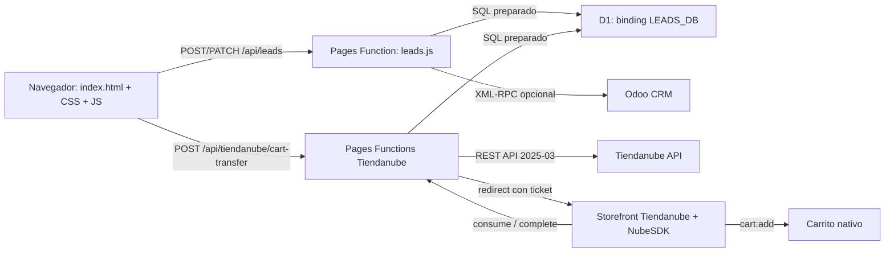

# Manual para aprender SetupOficina / PrimOffice

Este manual explica el sistema que realmente está presente en el repositorio. Las relaciones se obtuvieron recorriendo los 131 archivos versionados, los 52 archivos fuente, los imports, los scripts cargados por `index.html`, las rutas de `functions/`, las consultas SQL y las pruebas.

Convenciones de lectura:

- **HECHO VERIFICADO:** existe evidencia directa en los archivos inspeccionados.
- **INFORMACIÓN NO IDENTIFICADA:** el repositorio no contiene evidencia suficiente para confirmar el dato.
- Los hallazgos describen el comportamiento actual. No implican que se haya corregido, refactorizado o ampliado nada.
- Los comentarios agregados al código son educativos; el comportamiento original se conserva.

## 1. Qué hace el proyecto

**HECHO VERIFICADO:** SetupOficina es una landing comercial estática de PrimOffice. Una persona puede:

1. responder un test ergonómico de seis preguntas;
2. obtener un nivel Starter, Pro o Epic según el puntaje;
3. dejar sus datos y consentimiento;
4. ver una composición fotográfica 2D de su setup;
5. activar o desactivar productos y observar el total y un radar de impacto;
6. preparar un combo o carrito personalizado;
7. consultar por WhatsApp;
8. enviar el lead a una Cloudflare Pages Function;
9. almacenar el lead en D1;
10. sincronizarlo opcionalmente con Odoo por XML-RPC;
11. transferir la selección a un carrito nativo de Tiendanube cuando los dos feature flags correspondientes estén habilitados y la infraestructura externa esté configurada.

La landing no usa un framework frontend. El HTML principal contiene buena parte de la lógica comercial y se complementa con JavaScript clásico, módulos ECMAScript y CSS local.

`js/setup-3d.js` contiene un visualizador Three.js anterior, pero **no forma parte de la ejecución actual**: ningún HTML o módulo lo carga.

## 2. Arquitectura general

### Frontend

**HECHO VERIFICADO:**

- Entrada: `index.html`.
- Estilos: seis bloques inline y cuatro archivos bajo `css/`.
- Lógica inline: navegación, quiz, catálogo, radar, carrito, formulario, sesión de lead y WhatsApp.
- Módulos: configuración pública, servicio de leads, servicio de transferencia y compositor 2D.
- Estado comercial: objetos en memoria `cartState` y `extrasState`.
- Persistencia local: leads demo y offsets de calibración.

### Backend

**HECHO VERIFICADO:** Cloudflare Pages Functions usa enrutamiento por archivos bajo `functions/`.

- `/api/leads` concentra D1 y Odoo.
- `/api/tiendanube/*` separa wrappers de ruta y módulos reutilizables.
- `_routes.json` incluye `/api/*` y no excluye ninguna subruta API.

### Base de datos

**HECHO VERIFICADO:** todo el código espera un binding D1 llamado `LEADS_DB`.

- `db/schema_leads.sql` describe la tabla `leads` para bases nuevas.
- `db/migrations/0001_tiendanube_cart_bridge.sql` crea cinco tablas del puente.
- Las consultas de runtime usan sentencias preparadas y parámetros enlazados.

### Servicios externos

**HECHO VERIFICADO:**

- Odoo: endpoints XML-RPC `/xmlrpc/2/common` y `/xmlrpc/2/object`.
- Tiendanube: OAuth, REST API versionada `2025-03`, webhooks de privacidad y NubeSDK.
- WhatsApp: enlaces `wa.me` generados en el navegador.
- Google Fonts: recursos de `fonts.googleapis.com` y `fonts.gstatic.com`.
- PrimOffice: URLs de combos y tienda como fallback comercial.

### Hosting

**HECHO VERIFICADO:** la estructura `functions/`, `_routes.json`, referencias a `pages.dev` y los artefactos locales de Wrangler demuestran que el proyecto está preparado para Cloudflare Pages con Pages Functions.

**INFORMACIÓN NO IDENTIFICADA:** no existe `wrangler.toml`, `wrangler.json` ni `wrangler.jsonc` versionado. No se pueden comprobar desde Git el nombre del proyecto Pages, la fecha de compatibilidad, el ID/nombre de D1, los bindings desplegados, secrets, reglas WAF, observabilidad ni qué commit está publicado.

## 3. Punto de entrada

El punto de entrada activo es `index.html`.

1. El navegador interpreta el `DOCTYPE`, metadata, recursos SEO/PWA y preloads de imágenes.
2. Aplica CSS inline y cuatro hojas locales en el orden declarado.
3. Construye el DOM de navegación, hero, test, formulario, resultado, configurador, radar, combos, beneficios, CTA y pie.
4. Ejecuta el IIFE inline situado al final del markup. En ese momento los nodos que consulta ya existen.
5. El IIFE registra eventos, crea estado inicial y publica `window.PrimOfficeHybridBridge`.
6. Los scripts clásicos con `defer` inicializan el pulido visual y el comparador.
7. Los módulos publican `PrimOfficeConfig`, `PrimOfficeLeads`, `PrimOfficeTiendanube` y `SetupVisualHybrid`.
8. `setup-visual-hybrid.js` importa el manifiesto visual y la calibración, y sincroniza la escena con el bridge del HTML.

Sin `index.html` no existe una segunda aplicación que arranque el frontend. Sin el IIFE inline seguiría apareciendo markup estático, pero no funcionarían quiz, estado comercial, formulario, radar, carrito o WhatsApp detallado.

## 4. Flujo de carga de página

1. Se solicitan `index.html`, fuentes, CSS, logos y las capas PNG preloaded.
2. El HTML crea los elementos con IDs que posteriormente usa JavaScript.
3. La lógica inline abre/cierra menú y renderiza la primera pregunta.
4. Se inicializan `step`, `answers`, `cartState`, `extrasState`, el estado del radar y `pqLeadSession`.
5. `pulido-visual.js` crea un canvas de fondo, partículas y observadores de aparición.
6. `comparacion-antes-despues.js` conecta pointer, teclado e intersección al comparador hero.
7. `app-config.js` instala la configuración pública versionada.
8. `leads-service.js` instala las funciones POST/PATCH/demo.
9. `tiendanube-cart-transfer.js` instala el puente y oculta su botón exclusivo mientras el flag está apagado.
10. `setup-visual-hybrid.js` crea una imagen por capa, registra eventos delegados y publica su API.
11. Si la query contiene `calibrate=1`, se activa el controlador temporal de calibración y su almacenamiento local.
12. La interfaz queda lista sin consultar D1, Odoo o Tiendanube durante una visita normal.

No se registra service worker. `site.webmanifest` configura metadata de instalación, pero no existe lógica offline, caché PWA ni interceptación de red.

## 5. Flujo del formulario

1. La persona responde las seis preguntas.
2. Cada opción guarda un valor de 1 a 3 en `answers`.
3. Al terminar, `pqOnComplete()` calcula el diagnóstico y presenta primero un adelanto.
4. `pqTeaserCta` muestra `pqLeadForm`.
5. El canal seleccionado habilita email o WhatsApp y vuelve obligatorio sólo el campo correspondiente.
6. `pqValidate()` comprueba nombre, canal, dato de contacto y consentimiento.
7. `pqPayload()` reúne contacto, respuestas, score, nivel/preset, configuración actual, UTM, origen y fechas.
8. `pqSubmit()` llama `PrimOfficeLeads.submitLead()`.
9. En host local, `DEMO_MODE=true` o URL vacía, el servicio intenta guardar en `localStorage`.
10. En modo real, `fetch()` hace POST a `/api/leads` con JSON y timeout.
11. Sólo un POST exitoso crea la sesión en memoria `pqLeadSession` y revela el resultado completo.
12. Cambios posteriores del carrito producen un PATCH con el mismo `leadId`, tras debounce de un segundo y deduplicación por firma.

**HECHO VERIFICADO:** si el módulo de leads no está disponible, el IIFE contiene un fallback demo que también intenta guardar PII localmente.

**HECHO VERIFICADO:** el frontend puede enviar un header `Authorization` si se configurara `LEADS_API_TOKEN`, pero `functions/api/leads.js` no lo valida ni lo consume.

## 6. Flujo del configurador

### Productos

El objeto inline `P` es el catálogo comercial activo del navegador. Contiene ID, nombre, precio, stock y categoría para once productos. No contiene IDs de producto/variante Tiendanube.

### Presets

`COMBO_PRESETS` define listas de IDs para Starter, Pro y Epic. `applyComboPreset()` transforma una lista de preset en valores booleanos de `cartState`/`extrasState`, vuelve a renderizar y comunica el cambio al visualizador.

### Estado

- `cartState`: productos principales seleccionados.
- `extrasState`: productos adicionales.
- `answers`: respuestas del quiz.
- `pqLeadSession`: identidad y última configuración del lead después de un POST exitoso.
- El estado no se persiste al recargar, excepto modo demo de leads y calibración.

### Posiciones e imágenes

`js/setup-visual-config.js` contiene el manifiesto efectivo del navegador:

- canvas lógico de 1254 × 1254;
- layouts `standard` y `standing`;
- rutas a capas PNG;
- orden de composición;
- relación entre IDs comerciales y capas visuales.

Las posiciones dependen del tipo de escritorio, no del preset. `deriveVisibleSetupLayers()` siempre elige exactamente un escritorio y añade las capas correspondientes a productos seleccionados.

### Selección

`setup-visual-hybrid.js` puede recibir cambios desde:

- checkboxes del carrito;
- rail visual;
- botones Starter/Pro/Epic;
- API `PrimOfficeHybridBridge`.

Después de cada cambio vuelve a renderizar capas, rail, mini panel, total y radar. En modo calibración, la captura de presets sólo cambia la presentación temporal y no debe mutar la selección comercial.

### Componentes no activos

`js/setup-3d.js` modela un setup mediante Three.js, cámaras, materiales y drag 3D. No se carga ni existe import map/paquete raíz que resuelva sus imports bare de `three`; se conserva como fuente legacy para estudio, no como dependencia del runtime actual.

## 7. Flujo de lead

### POST inicial

1. `index.html` construye el payload.
2. `js/services/leads-service.js` hace POST a `/api/leads`.
3. `onRequestPost()` exige `LEADS_DB`, tamaño declarado menor o igual a 100.000 bytes, JSON parseable, nombre, consentimiento, canal/contacto y score numérico.
4. Normaliza teléfono, tier y preset.
5. Genera/reutiliza `leadId` y prepara campos escalares/JSON.
6. Inserta primero en `leads` mediante `prepare().bind().run()`.
7. Intenta sincronizar con Odoo si está habilitado/configurado.
8. Actualiza las columnas Odoo de D1 con `synced`, `pending` o `error`.
9. Devuelve `201` cuando D1 guardó el lead, incluso si Odoo falló de manera controlada.

### PATCH posterior

1. El frontend conserva el `leadId` del POST.
2. Un cambio de carrito programa `updateLead()`.
3. El servicio hace PATCH a la misma ruta.
4. El backend busca `odoo_lead_id` por `lead_id`; no confía en un ID Odoo enviado por el cliente.
5. Si existe ID Odoo, intenta escribir el mismo lead remoto.
6. Actualiza selección, total, payload y estado Odoo en D1.
7. Devuelve `200` con `updated:true`.

### Seguridad observada

**HECHO VERIFICADO:** `/api/leads` tiene allowlist CORS para el header de respuesta, pero no rechaza la ejecución de POST/PATCH por origen, no autentica `Authorization` y no aplica rate limiting. CORS controla qué respuestas puede leer un navegador, no constituye por sí mismo autenticación del endpoint.

**HECHO VERIFICADO:** no se modificó este comportamiento; sólo se documentó.

## 8. Flujo Odoo

### Cómo lo usa este proyecto

1. `ODOO_ENABLED` debe ser el texto `true`.
2. También deben existir `ODOO_URL`, `ODOO_DB`, `ODOO_USERNAME` y `ODOO_API_KEY`.
3. `getOdooSession()` llama `authenticate` en `{ODOO_URL}/xmlrpc/2/common`.
4. Odoo devuelve un `uid` numérico.
5. `odooExecuteKw()` llama `execute_kw` en `/xmlrpc/2/object`.
6. Para tags usa el modelo `crm.tag` y métodos `search`, `create` y, en actualizaciones, lectura de IDs.
7. Para el lead usa `crm.lead.create` o `crm.lead.write`.
8. `buildOdooLead()` arma nombre, contacto, email, teléfono, ingreso estimado, descripción HTML y comandos `tag_ids`.
9. En PATCH preserva tags ajenos a PrimOffice y sustituye el conjunto administrado por origen, tier y canal actuales.
10. El resultado se refleja en `odoo_status`, `odoo_lead_id`, `odoo_error` y `odoo_synced_at` de D1.

### Qué significa XML-RPC

XML-RPC es un protocolo para invocar métodos remotos mediante solicitudes HTTP cuyo cuerpo está escrito en XML. En este proyecto:

- `xmlValue()` convierte valores JavaScript a tipos XML-RPC;
- `xmlRpcCall()` arma `<methodCall>`, hace POST `text/xml`, aplica timeout y lee la respuesta;
- las funciones `findXmlElement()`/`parseXmlRpcTypedValue()` interpretan arrays, structs, enteros, doubles, booleanos, strings y nil;
- una respuesta `<fault>` se convierte en `Error`.

No se usa una dependencia XML-RPC externa; el serializador/parser está implementado dentro de `functions/api/leads.js`.

**INFORMACIÓN NO IDENTIFICADA:** versión real de Odoo, módulos instalados, permisos del usuario/API key, URL/DB productivas y personalizaciones del modelo remoto.

## 9. Flujo Tiendanube

### 9.1 Configuración y catálogo

1. `config/tiendanube-catalog.json` relaciona once `internal_id` con SKU y nombre.
2. `tools/tiendanube-sync-catalog.mjs` lee esa fuente y consulta productos por SKU.
3. Exige una única variante coincidente por SKU.
4. Genera SQL UPSERT bajo `db/generated/`; no lo aplica automáticamente.
5. D1 relaciona `(store_id, internal_id)` con product/variant IDs reales, cantidad máxima y estado enabled.

### 9.2 OAuth

1. Un operador abre `GET /api/tiendanube/oauth/start`.
2. El backend valida entorno, callback, App ID y que no exista instalación activa.
3. Genera un state aleatorio de 32 bytes, guarda sólo SHA-256 en D1 y coloca el original en cookie `HttpOnly`, `Secure`, `SameSite=Lax`.
4. Redirige a la autorización de Tiendanube.
5. Tiendanube vuelve a `/oauth/callback` con `code` y `state`.
6. Se comparan query, cookie, hash, entorno, expiración y consumo único.
7. El code se intercambia por token.
8. Se exigen exactamente `read_products` y `write_scripts`.
9. Se consulta la tienda y se valida su dominio contra la allowlist.
10. El token se cifra con AES-256-GCM, IV aleatorio y Store ID como datos autenticados adicionales.
11. D1 guarda ciphertext, IV, scopes y metadata mínima.
12. `/oauth/status` devuelve sólo estado público sanitizado para el Store ID configurado.

### 9.3 Prepare en SetupOficina

1. Un botón de compra llama `selectedTiendanubeTransferItems()`.
2. El frontend envía sólo `clientRequestId`, `internalId` y `quantity` a `/cart-transfer`.
3. La Function comprueba flag, Origin, JSON estricto, UUID, cantidades, duplicados, Store ID y rate limit.
4. Carga del catálogo únicamente las filas autorizadas.
5. Consulta cada producto real en la API Tiendanube.
6. Comprueba producto/variante, visibilidad, stock y precio.
7. Separa disponibles/no disponibles.
8. Genera un ticket aleatorio; D1 guarda sólo su SHA-256 y JSON resuelto durante un máximo de 600 segundos.
9. Devuelve una URL HTTPS de storefront con un único query `setupoficina_ticket`.
10. El frontend vuelve a validar protocolo, origen, ruta y forma del ticket antes de navegar.

### 9.4 Consume y carrito NubeSDK

1. El bundle `assets/tiendanube/main.min.js`, generado desde `tiendanube-script/src`, se ejecuta en el storefront instalado externamente.
2. `App()` procesa la ubicación inicial y cambios `location:updated`.
3. Con ticket llama `/cart-transfer/consume` enviando ticket y Store ID observado.
4. El backend crea un lease de 90 segundos y devuelve un processing token opaco, IDs reales y no disponibles.
5. `createLazySequentialCartAdder()` registra listeners de carrito recién en el primer uso.
6. Cada producto se envía secuencialmente con `cart:add`.
7. Éxito, fallo, excepción o timeout producen un resultado por ítem sin borrar el carrito anterior.
8. El script llama `/cart-transfer/complete` con el conjunto completo y el processing token.
9. El backend comprueba ticket, lease, token, IDs y cantidades antes de marcar `completed`.
10. El script guarda el resultado durante 600 segundos y navega a `/cart?setupoficina_result=1`.
11. En carrito consulta slots oficiales; prefiere `corner_top_right` con Toast y usa `modal_content` como fallback.
12. Tras mostrarlo elimina el resultado para no repetirlo.

### 9.5 Privacidad

Los tres webhooks verifican HMAC SHA-256 sobre el cuerpo crudo. `store-redact` elimina datos del puente para la tienda; los callbacks de clientes declaran que la app no conserva PII de clientes Tiendanube.

**INFORMACIÓN NO IDENTIFICADA:** instalación real de la app/script, tienda objetivo desplegada, callbacks configurados en Partners, scopes concedidos, catálogo D1 aplicado, feature flags productivos y bundle efectivamente instalado.

## 10. Flujo del carrito

### Carrito de la landing

1. `buildCart()` crea la selección recomendada desde respuestas y score.
2. `renderCart()` construye filas/checkboxes desde `P`.
3. Un cambio llama `updateProductSelection()`.
4. La función actualiza `cartState`/`extrasState` y las filas relacionadas.
5. `updateTotal()` suma precios estáticos seleccionados.
6. `updatePreview()` sincroniza visualizador y radar.
7. Si existe sesión de lead, programa PATCH.
8. WhatsApp consume el mismo estado para crear el mensaje.

### Carrito Tiendanube

La landing nunca envía precio, SKU, product ID o variant ID. D1 y el backend producen esos datos. NubeSDK consume IDs reales y usa una operación aditiva por ítem. El resultado vuelve al backend y a la UI del storefront.

### Datos y consumidores

| Dato | Quién lo crea | Dónde viaja | Quién lo consume |
|---|---|---|---|
| `internalId` | catálogo `P`/presets | frontend → prepare → D1 ticket → NubeSDK | catálogo D1, resultados |
| `quantity` | frontend (actualmente 1 por selección) | prepare → consume → cart:add → complete | backend y carrito |
| `productId`/`variantId` | sincronizador + API Tiendanube | D1 → consume → NubeSDK | `cart:add` |
| `ticket` | backend prepare | redirect URL → storefront → consume/complete | hash en D1 |
| `processingToken` | backend consume | respuesta consume → complete | hash/lease en D1 |
| `added`/`failed` | NubeSDK | complete + almacenamiento temporal | D1 completion y UI carrito |

## 11. Variables importantes

| Variable | Archivo | Tipo | Para qué sirve | Quién la modifica | Quién la consume |
|---|---|---|---|---|---|
| `P` | `index.html` | objeto | catálogo comercial, precio/stock/categoría | inicialización inline | carrito, radar, WhatsApp, presets |
| `questions` | `index.html` | array | seis preguntas y opciones puntuadas | no se modifica | `renderQ`, diagnóstico |
| `answers` | `index.html` | array | respuestas actuales | click de opción | score, radar, payload |
| `step` | `index.html` | número | pregunta visible | quiz/back | `renderQ` |
| `cartState` | `index.html` | objeto booleano | productos principales | presets, checkbox, rail | total, visual, lead, WhatsApp, Tiendanube |
| `extrasState` | `index.html` | objeto booleano | adicionales | checkbox/bridge | total, lead, WhatsApp |
| `COMBO_PRESETS` | `index.html` | objeto | IDs por Starter/Pro/Epic | no se modifica | acciones de combo |
| `pqLeadSession` | `index.html` | objeto | leadId y última sincronización | POST/PATCH | actualizaciones posteriores |
| `APP_CONFIG` | `js/config/app-config.js` | objeto | configuración pública | no se modifica | servicios frontend |
| `inFlight` | `js/services/tiendanube-cart-transfer.js` | Promise/null | evita doble transferencia | `transferSelection` | misma función |
| `SETUP_LAYER_MANIFEST` | `js/setup-visual-config.js` | objeto congelado | rutas y capas activas | no se modifica | compositor/calibración |
| `SETUP_LAYER_LAYOUT_BY_DESK` | `js/setup-visual-config.js` | objeto congelado | posiciones por escritorio | no se modifica | render/calibración |
| `SETUP_CALIBRATION_STORAGE_KEY` | `js/setup-visual-calibration.js` | string | clave de offsets locales | no se modifica | controlador calibración |
| `ALLOWED_ORIGINS` | `functions/api/leads.js` | Set | header CORS de leads | no se modifica | `corsHeaders` |
| `PRIMOFFICE_MANAGED_TAG_NAMES` | `functions/api/leads.js` | array congelado | tags Odoo administrados | no se modifica | resolución/preservación tags |
| `LEADS_DB` | entorno Functions | binding D1 | acceso a seis tablas | dashboard/entorno externo | leads y puente Tiendanube |
| `TIENDANUBE_ENABLED` | estático + entorno | boolean/string | feature flag en cada superficie | configuración/deploy externo | frontend y Functions |
| `REQUIRED_TIENDANUBE_SCOPES` | `scopes.mjs` | array congelado | permisos OAuth exactos | no se modifica | OAuth/instalaciones |
| `active` | `transfer-core.mjs` | operación/null | ítem NubeSDK pendiente | agregador | handlers/timeout |
| `sequence` | `transfer-core.mjs` | Promise | cola de lotes | `addSequentially` | siguiente lote |
| `processedTickets` | `storefront-flow.mjs` | Set | evita repetir ticket en la instancia | coordinador | coordinador |
| `API_BASE_URL` | `main.tsx` | string compilado | origen backend NubeSDK | tsup define | `postJson` |

Las variables de entorno se explican individualmente en `env.example.md`. Las cinco variables Odoo aparecen en código pero faltan en `.env.example`.

## 12. Funciones importantes

| Función | Archivo | Entrada | Salida | Quién la llama | Qué hace |
|---|---|---|---|---|---|
| `renderQ` | `index.html` | índice de pregunta | efecto DOM | inicio, opción, atrás | renderiza quiz y listeners |
| `buildCart` | `index.html` | respuestas | IDs recomendados | final del quiz | deriva preset/selección |
| `updateProductSelections` | `index.html` | cambios + opciones | efecto de estado/UI | presets, checkboxes, bridge | muta selección coherentemente |
| `applyComboPreset` | `index.html` | nombre preset | efecto estado/UI | acciones de combo | aplica lista canónica |
| `pqPayload` | `index.html` | estado actual | objeto lead | `pqSubmit` | arma contrato de lead |
| `scheduleLeadCartUpdate` | `index.html` | tipo evento | timer | cambios comerciales | aplica debounce de PATCH |
| `submitLead` | `leads-service.js` | payload | resultado Promise | `pqSubmit` | elige demo o POST real |
| `updateLead` | `leads-service.js` | payload | resultado Promise | actualización programada | elige demo o PATCH real |
| `transferSelection` | `tiendanube-cart-transfer.js` | IDs/cantidades | Promise | botones landing | bloquea duplicados y redirige |
| `deriveVisibleSetupLayers` | `setup-visual-config.js` | selección | array capas | compositor/tests | deriva escritorio + productos |
| `init` | `setup-visual-hybrid.js` | bridge/opciones | API/efectos | `autoInit` | crea/sincroniza visualizador |
| `createSetupCalibrationController` | `setup-visual-calibration.js` | nodos/storage/callbacks | controlador | compositor en query calibrate | drag, persistencia y exportación |
| `onRequestPost` | `functions/api/leads.js` | request/env | Response | Pages Functions | inserta lead y sincroniza Odoo |
| `onRequestPatch` | `functions/api/leads.js` | request/env | Response | Pages Functions | actualiza lead/Odoo existente |
| `xmlRpcCall` | `functions/api/leads.js` | endpoint, método, params | valor remoto | helpers Odoo | serializa, envía y parsea XML-RPC |
| `getOdooSession` | `functions/api/leads.js` | env | sesión/skip | create/update Odoo | autentica credenciales |
| `handleCartTransfer` | `transfers.mjs` | request/env | Response | wrapper prepare | valida/resuelve y crea ticket |
| `handleCartTransferConsume` | `transfers.mjs` | request/env | Response | wrapper consume | adquiere lease y devuelve IDs |
| `handleCartTransferComplete` | `transfers.mjs` | request/env | Response | wrapper complete | valida resultado y cierra ticket |
| `handleOAuthStart` | `oauth.mjs` | request/env | redirect/error | wrapper start | crea state/cookie |
| `handleOAuthCallback` | `oauth.mjs` | request/env | HTML | wrapper callback | intercambia, valida y guarda token |
| `enforceRateLimit` | `rate-limit.mjs` | db/request/ruta | fila o error | handlers Tiendanube | ventana fija D1 |
| `verifyWebhookHmac` | `security.mjs` | cuerpo/firma/secreto | boolean Promise | privacidad | verifica autenticidad SHA-256 |
| `runCatalogSync` | `tools/tiendanube-sync-catalog.mjs` | opciones/env | SQL Promise | CLI/tests | resuelve catálogo sin aplicarlo |
| `createLazySequentialCartAdder` | `transfer-core.mjs` | NubeSDK/opciones | agregador | `App` | difiere listeners hasta ticket |
| `createLocationCoordinator` | `storefront-flow.mjs` | callbacks | handler | `App` | decide transferir/mostrar/nada |
| `executeTransfer` | `main.tsx` | SDK, agregador, ticket, tienda | Promise de efectos | coordinador | consume, agrega, completa, navega |

## 13. Eventos

| Evento | Elemento/emisor | Archivo | Handler | Consecuencia |
|---|---|---|---|---|
| `click` | menú | `index.html` | callback inline | alterna `.open` |
| `click` | opción quiz | `index.html` | callback de `renderQ` | guarda respuesta y avanza |
| `click` | atrás quiz | `index.html` | callback inline | vuelve una pregunta |
| `submit` | `pqLeadForm` | `index.html` | `pqSubmit` | valida y envía lead |
| `change` | radios canal | `index.html` | `pqUpdateCanal` | habilita email/WhatsApp |
| `change` | checkbox carrito | `index.html` | callback de `renderCart` | cambia selección |
| `click` | `[data-combo-preset]` | `index.html` | callback común | preview/compra/WhatsApp |
| `pointerdown/move/up/cancel` | comparador | `comparacion-antes-despues.js` | `down/move/up` | mueve separación |
| `keydown` | comparador | `comparacion-antes-despues.js` | callback inline | ajuste accesible |
| `resize`/`scroll`/`mousemove` | viewport | `pulido-visual.js` | handlers internos | canvas/parallax/intensidad |
| `visibilitychange` | página | `pulido-visual.js` | handler | pausa/reanuda animación |
| `click`/`keydown` | raíz visual | `setup-visual-hybrid.js` | handlers delegados | selecciona/toggle producto |
| pointer + teclado | escena calibración | `setup-visual-calibration.js` | handlers internos | modifica offsets |
| `cart:add:success` | NubeSDK | `transfer-core.mjs` | `onSuccess` | confirma ítem activo |
| `cart:add:fail` | NubeSDK | `transfer-core.mjs` | `onFail` | marca fallo y continúa |
| `location:updated` | NubeSDK | `main.tsx` | `handleLocation` | procesa ticket/resultado |

Además se usan `IntersectionObserver`, `ResizeObserver` y `requestAnimationFrame`; son APIs callback/animación, no eventos DOM tradicionales.

## 14. Endpoints

| Método | Ruta | Archivo | Entrada | Respuesta principal | Consumidor |
|---|---|---|---|---|---|
| GET | `/api/leads` | `functions/api/leads.js` | env | estado servicio/Odoo | diagnóstico manual |
| POST | `/api/leads` | mismo | lead JSON | `201`, leadId/Odoo | `leads-service.js` |
| PATCH | `/api/leads` | mismo | lead JSON + leadId | `200`, updated/Odoo | `leads-service.js` |
| OPTIONS | `/api/leads` | mismo | Origin/headers | `204` CORS | navegador |
| POST | `/api/tiendanube/cart-transfer` | wrapper + `transfers.mjs` | clientRequestId + items | `201`, redirect/unavailable | landing |
| OPTIONS | misma | mismos | Origin | `204` | navegador |
| POST | `/api/tiendanube/cart-transfer/consume` | wrapper + `transfers.mjs` | ticket + storeId | `200`, processingToken/items | NubeSDK |
| OPTIONS | misma | mismos | Origin | `204` | storefront |
| POST | `/api/tiendanube/cart-transfer/complete` | wrapper + `transfers.mjs` | ticket/token/store/result | `200` | NubeSDK |
| OPTIONS | misma | mismos | Origin | `204` | storefront |
| GET | `/api/tiendanube/oauth/start` | wrapper + `oauth.mjs` | request/env | `302` | operador |
| GET | `/api/tiendanube/oauth/callback` | wrapper + `oauth.mjs` | code/state/cookie | HTML | Tiendanube/navegador |
| GET | `/api/tiendanube/oauth/status` | wrapper + `oauth.mjs` | env | JSON público | diagnóstico |
| POST | `/api/tiendanube/privacy/store-redact` | wrapper + `privacy.mjs` | cuerpo raw + HMAC | `200` | webhook Tiendanube |
| POST | `/api/tiendanube/privacy/customers-redact` | wrapper + `privacy.mjs` | cuerpo raw + HMAC | `200` | webhook Tiendanube |
| POST | `/api/tiendanube/privacy/customers-data-request` | wrapper + `privacy.mjs` | cuerpo raw + HMAC | `200` | webhook Tiendanube |

Los endpoints Tiendanube devuelven JSON `no-store` y errores estructurados; OAuth callback usa HTML. Leads no configura `Cache-Control: no-store`.

## 15. Base de datos

| Tabla | Columnas utilizadas | Archivos que acceden | Operaciones |
|---|---|---|---|
| `leads` | todas las declaradas en `schema_leads.sql` | `functions/api/leads.js` | INSERT, SELECT por lead_id, UPDATE comercial/Odoo |
| `tiendanube_catalog` | store_id, internal_id, expected_sku, display_name, product_id, variant_id, enabled, max_quantity, timestamps | `transfers.mjs`, sincronizador, privacy | SELECT, UPSERT generado, DELETE |
| `tiendanube_cart_transfers` | hashes, store, request ID, JSON, status, fechas, lease/token, completion | `transfers.mjs`, privacy | INSERT, SELECT, UPDATE atómico, DELETE |
| `tiendanube_rate_limits` | key_hash, route, window_start, request_count, expires_at | `rate-limit.mjs`, privacy | DELETE expirados, UPSERT/RETURNING, DELETE |
| `tiendanube_oauth_states` | state_hash, environment, store_id, fechas/consumo | `oauth.mjs`, privacy | DELETE, INSERT, UPDATE, SELECT |
| `tiendanube_installations` | store, domain, token cifrado, IV, scopes, fechas/revocación | `installations.mjs`, privacy | SELECT, INSERT, UPDATE, DELETE |

`db/schema_leads.sql` no es una migración para una base histórica. **INFORMACIÓN NO IDENTIFICADA:** no se puede demostrar que sus columnas Odoo o la migración Tiendanube estén aplicadas en la D1 real.

## 16. Servicios externos

### Cloudflare Pages / Functions

- Recibe archivos estáticos y rutas `/api/*`.
- Inyecta `env` y el binding D1.
- No hay configuración deploy versionada suficiente para describir el entorno real.

### Cloudflare D1

- Recibe SQL preparado y datos enlazados.
- Devuelve filas/metadata mediante `.first()`, `.all()`, `.run()` y `.batch()`.
- Es controlado por `functions/api/leads.js` y módulos Tiendanube.

### Odoo

- Recibe XML con credenciales y métodos `authenticate`/`execute_kw`.
- Devuelve valores XML-RPC, IDs y confirmaciones.
- Es controlado íntegramente desde `functions/api/leads.js`.

### Tiendanube REST/OAuth

- Recibe Bearer token, Store ID, versión y User-Agent.
- Devuelve tokens OAuth, tienda, productos/variantes, stock y precio.
- Es controlado por `client.mjs`, `oauth.mjs`, `installations.mjs`, `transfers.mjs` y el sincronizador.

### Tiendanube NubeSDK

- Recibe comandos de carrito y componentes a renderizar.
- Emite éxito/fallo y cambios de ubicación.
- Es controlado por `tiendanube-script/src/*`.

### WhatsApp

- Recibe un mensaje URL-encoded en `wa.me`.
- No devuelve datos al código inspeccionado; se abre una nueva pestaña/ventana.
- Es controlado por funciones inline de `index.html`.

### Google Fonts

- Entrega Open Sans y Poppins al navegador.
- Se declara en enlaces del `<head>`; no existe JavaScript propio para este servicio.

## 17. Dependencias

No existe `package.json` raíz. La landing usa APIs estándar del navegador y recursos estáticos.

Dependencias directas de `tiendanube-script/package.json`:

| Dependencia | Uso comprobado |
|---|---|
| `@tiendanube/nube-sdk-jsx` | runtime JSX y componentes `Column`, `Text`, `Toast` |
| `@tiendanube/nube-sdk-types` | tipo TypeScript `NubeSDK` |
| `@tiendanube/nube-sdk-ui` | dependencia directa declarada; no hay import directo en el código fuente inspeccionado |
| `tsup` | bundling/minificación de `src/main.tsx` a `assets/tiendanube/main.min.js` |
| `typescript` | typecheck estricto con `tsc --noEmit` |

`package.json` también fuerza `esbuild` mediante `overrides`; el lockfile resuelve esbuild 0.28.1, tsup 8.5.1 y TypeScript 5.9.3. El lockfile contiene 104 entradas de paquete y es generado, por lo que no se comentó inline.

`js/setup-3d.js` intenta importar `three` y addons mediante bare specifiers, pero esa dependencia no está declarada en el único package del repo y el archivo no se carga.

## 18. Glosario

| Concepto | Explicación sencilla en este proyecto |
|---|---|
| DOM | árbol de elementos creado desde `index.html`; JavaScript consulta IDs/clases y cambia atributos/contenido |
| API | contrato que permite que dos partes se comuniquen, como frontend→Function o script→NubeSDK |
| endpoint | URL y método que atienden una operación concreta |
| HTTP | protocolo de solicitudes/respuestas usado por `fetch` y XML-RPC |
| GET | método de lectura/diagnóstico o inicio/callback OAuth |
| POST | método usado para crear leads, tickets, consumir/completar y webhooks |
| PATCH | método usado para actualizar un lead ya creado |
| OPTIONS | preflight CORS que pregunta qué métodos/headers acepta una ruta |
| JSON | texto estructurado usado en payloads, respuestas, columnas y configuración |
| XML | formato de etiquetas usado por el protocolo Odoo XML-RPC |
| XML-RPC | convención para invocar métodos remotos codificando método/parámetros en XML |
| módulo | archivo que exporta/importa valores con `export`/`import` |
| async | marca una función que devuelve una Promise |
| await | pausa lógica dentro de una función async hasta que una Promise se resuelva/rechace |
| Promise | objeto que representa un resultado futuro, por ejemplo una petición o agregado al carrito |
| callback | función entregada para ejecutarse después, como handler de evento o timer |
| event listener | callback registrado para reaccionar a interacción o eventos del SDK |
| estado | datos que cambian durante la sesión, como `cartState` o `active` |
| closure | función que conserva acceso a variables del ámbito donde nació; se usa en handlers y coordinadores |
| localStorage | almacenamiento síncrono del navegador usado para demo de leads y calibración |
| asyncSessionStorage | almacenamiento asíncrono provisto por NubeSDK para el resultado temporal |
| CORS | headers/reglas del navegador para permitir lectura cross-origin; no reemplaza autenticación |
| Origin | combinación protocolo+host+puerto que identifica el sitio iniciador |
| D1 | base SQL administrada por Cloudflare y compatible con semántica SQLite |
| binding | nombre (`LEADS_DB`) mediante el cual una Function recibe un recurso configurado externamente |
| Pages Function | función serverless enrutada por la estructura de `functions/` |
| prepared statement | SQL con placeholders que separa consulta y valores para reducir inyección |
| UPSERT | INSERT que actualiza una fila cuando ya existe una clave conflictiva |
| SKU | código comercial esperado para identificar una variante en el catálogo |
| variant | versión comprable concreta de un producto; el carrito usa su ID |
| hash | resumen irreversible; se guardan SHA-256 de tickets/state/tokens de procesamiento |
| HMAC | firma con secreto compartido usada para autenticar webhooks |
| OAuth | flujo de autorización que entrega un access token sin incluirlo en la URL inicial |
| state OAuth | valor aleatorio de un solo uso que relaciona inicio y callback y reduce falsificación |
| cookie HttpOnly | cookie inaccesible al JavaScript normal; aquí conserva el state original |
| AES-256-GCM | cifrado autenticado usado para guardar tokens Tiendanube en D1 |
| IV | valor único por cifrado; no es secreto, pero no debe repetirse con la misma clave |
| AAD | datos autenticados no cifrados; el Store ID vincula ciphertext e instalación |
| CSPRNG | generador aleatorio criptográficamente seguro usado para tickets/state/IV |
| TTL | tiempo máximo de vida, por ejemplo 600 segundos para ticket/resultado |
| lease | permiso temporal de procesamiento que permite recuperar un ticket abandonado |
| rate limiting | contador por ventana que bloquea demasiadas solicitudes Tiendanube |
| idempotencia | evitar que repetir una solicitud produzca duplicados; clientRequestId/tickets ayudan a lograrlo |
| webhook | solicitud server-to-server enviada por Tiendanube ante un evento de privacidad |
| feature flag | interruptor de configuración; Tiendanube tiene uno público y otro backend |
| UTM | parámetros de campaña capturados desde la URL y guardados con el lead |
| canvas | superficie de dibujo usada por radar, fondo y el visualizador legacy |
| JSX | sintaxis declarativa de componentes compilada para NubeSDK |
| bundle | archivo que reúne el grafo de imports para distribuirlo como una unidad |
| minificación | eliminación/compactación de sintaxis no necesaria para reducir el artefacto generado |
| fallback | camino alternativo, como WhatsApp/URLs de combos o almacenamiento demo |

Para el recorrido por archivo y el orden pedagógico completo, continuar con `FILE-MAP.md`, `EXECUTION-MAP.md` y `STUDY-ORDER.md`.
